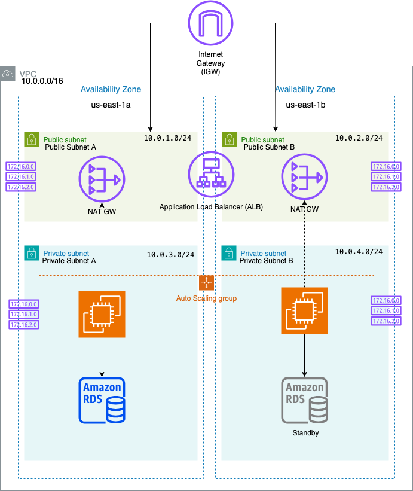

# 🛠️ AWS Highly Available and Secure 3-Tier Infrastructure (Terraform)

This project provisions a **highly available**, **secure**, and **scalable 3-tier infrastructure** on AWS using Terraform. It follows best practices in modular design, network segmentation, least privilege access, and observability. This setup reflects how production-grade cloud infrastructure is deployed and maintained in real-world environments, including:
- Dual NAT Gateway setup for zone-level fault isolation
- Private subnets routed via independent NAT Gateways in separate AZs

---

## 🧱 Architecture Diagram



---

## 🔧 Technologies Used

- Terraform (IaC)
- AWS VPC, Subnets, Internet Gateway, Dual NAT Gateways (for HA)
- Application Load Balancer (ALB)
- EC2 (Auto Scaling Group, Launch Template)
- Amazon RDS (MySQL, Multi-AZ)
- CloudWatch Logs, VPC Flow Logs
- IAM Roles and Policies
- Security Groups and Private Networking

---

## 🚀 How to Deploy

```bash
# Clone the repo
git clone https://github.com/nemanjap011/aws-ha-secure-infra.git
cd aws-ha-secure-infra

# Initialize Terraform
terraform init

# Review the execution plan
terraform plan

# Apply the infrastructure
terraform apply
